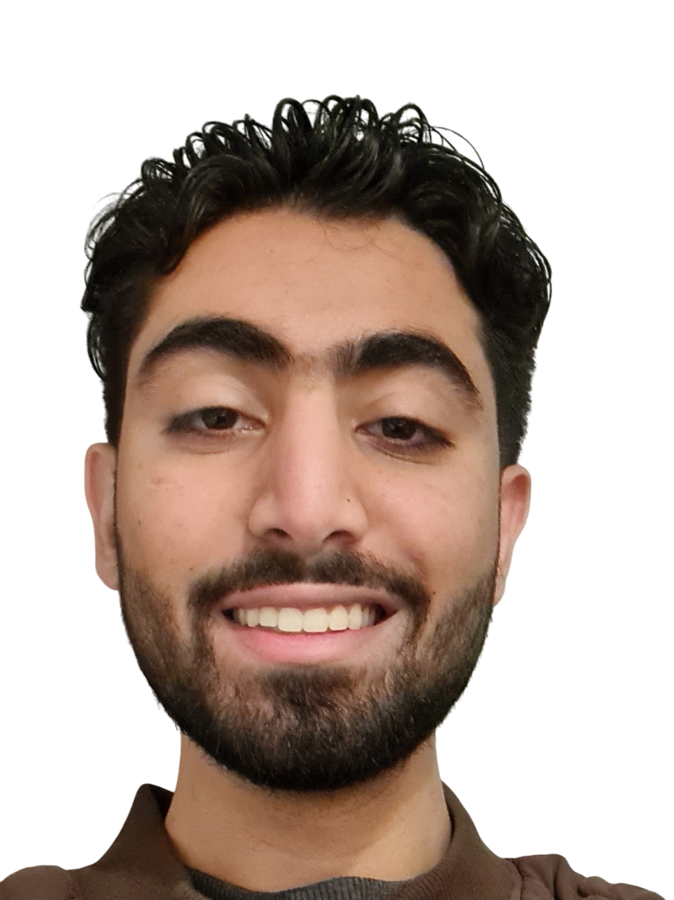

{width=250px}

I am Arman Thariani and I grew up in Dubai.
I am coming to the MDS directly from my undergraduate degree where I studied computer science with a minor in linguistics at UBC as well.
I am hoping to use this to move to a more data-oriented side of software and potentially move into something ML-related or data engineering.
Most recently I have been interning at a genomics startup.
