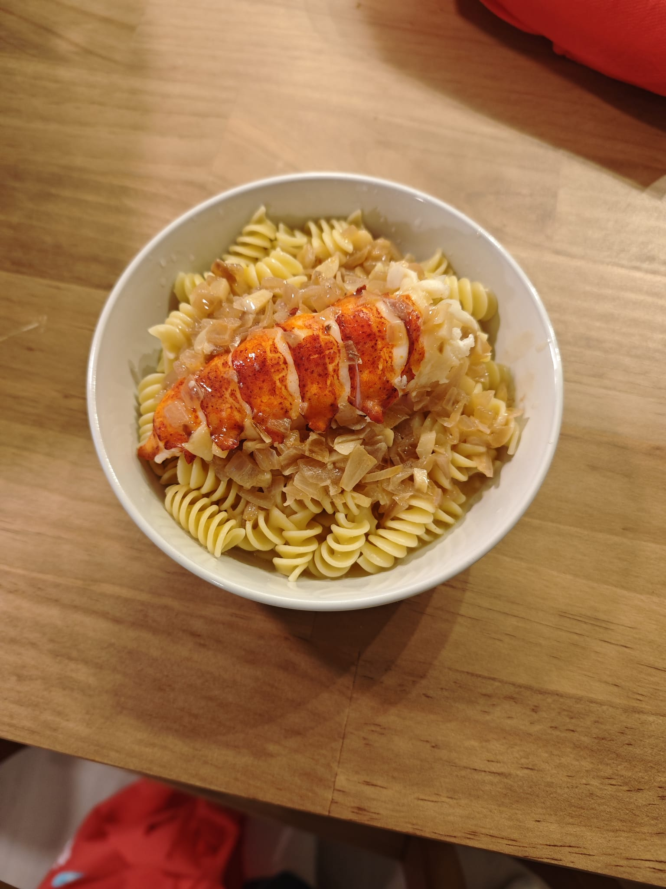

The first week was rough. Not the program itself but everything outside of it.
I was still moving apartments and having to make multiple trips across the city to move furniture.
My kitchen is still bare and there are boxes everywhere.
The level of disorganization is very evident but somehow I feel in control of the academic side of things.

I started the program with my mind elsewhere so the orientation passed by without much notice.
There were many people to meet but I still hesitated. It is only now that I am catching up.

Alongside the social and academic catch up, I have managed to cook my first meal at the new place.
This has somehow coincided with submitting the first round of labs.
Since all of this is coming together at the same time, I feel a bit of relief.
I think I am in a better situation to get moving with this degree.